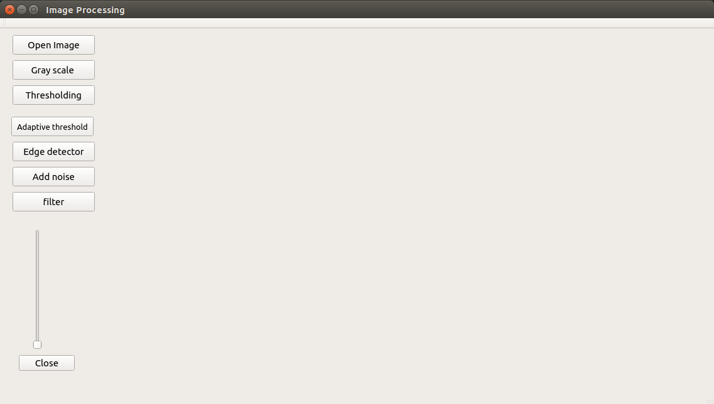
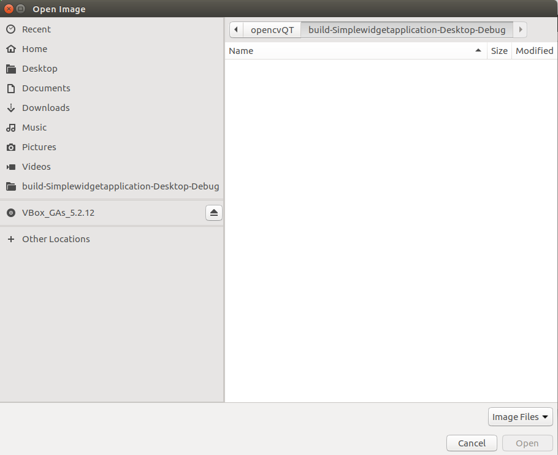
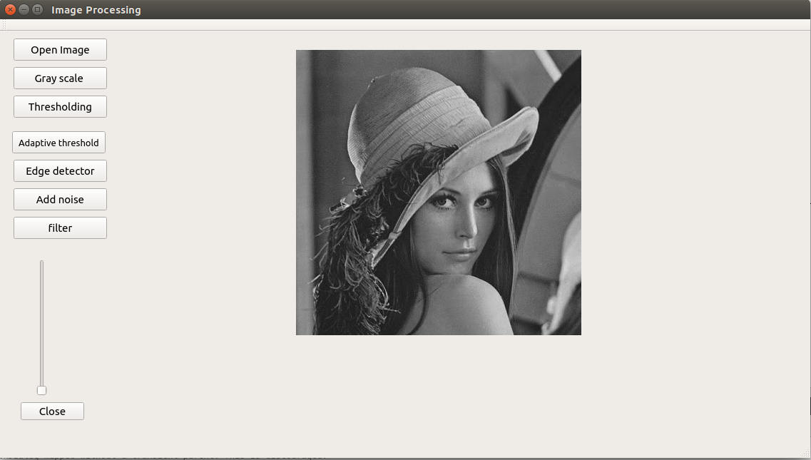
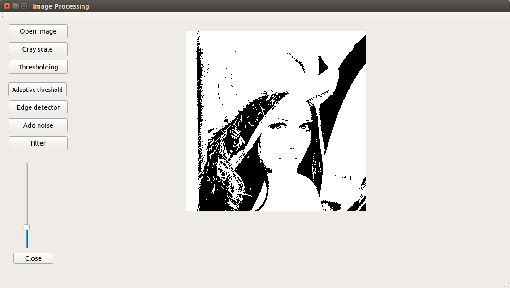
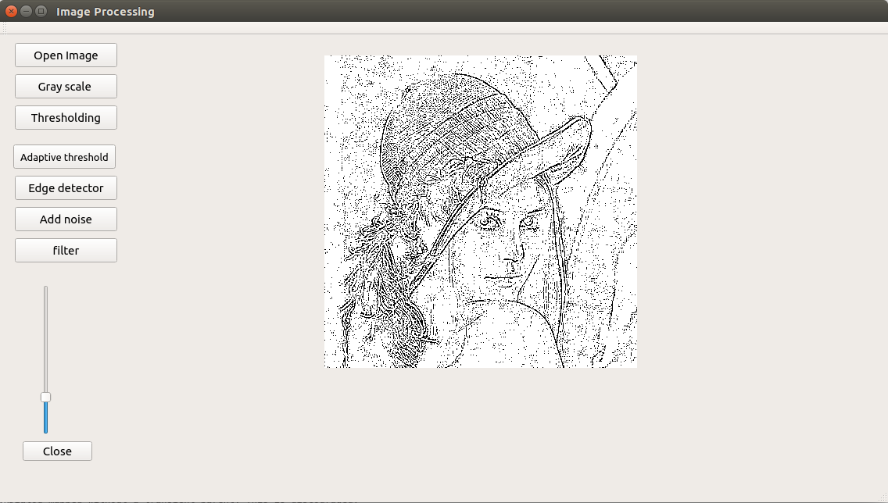
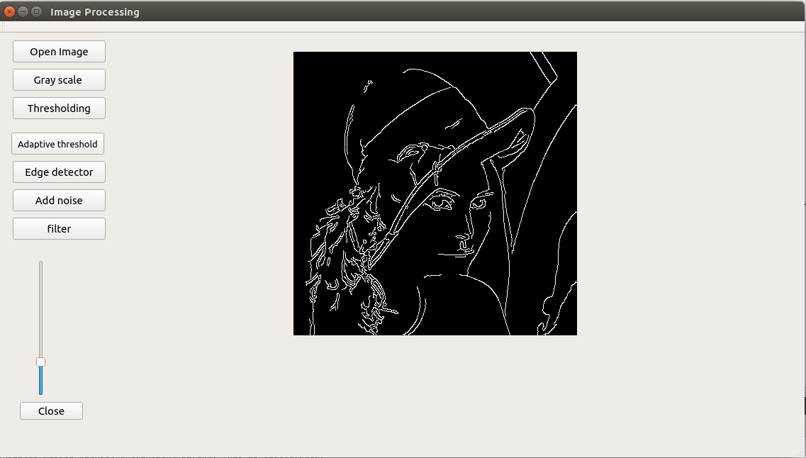
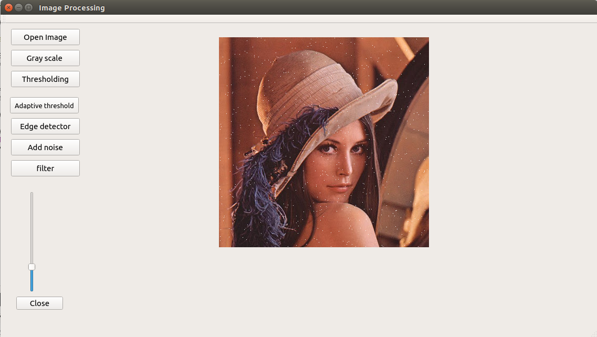
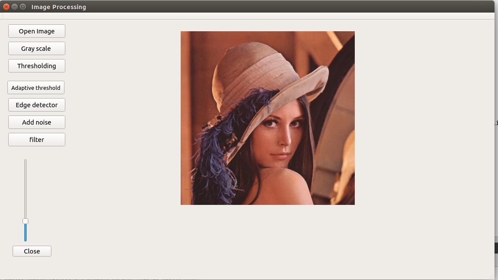

The program is completely written using C++ on QT framework. I have designed a simple GUI for performing basic image processing operations such as GRAY SCALE CONVERSION, IMAGE THRESHOLDING, EDGE DETECTION, ADDING NOISE TO THE IMAGE, FILTERING. All of the image processing was performed using the OpenCV library files. The application was developed on Linux platform. 

The program is written such that you can load any image of type .png .jpg .jpeg .bmp directly from the GUI

By clicking the open image button you open a file browser which can be used to select the image file you want to select.

The gray scale button converts a 3 channel (RGB image) to 1 channel (gray image) the formula used for this conversion is Y = 0.299 R + 0.587 G + 0.114 B

Image thresholding is a simple, yet effective, way of partitioning an image into a foreground and background. This image analysis technique is a type of image segmentation that isolates objects by converting grayscale images into binary images. Image thresholding is most effective in images with high levels of contrast.
the thresholding button uses the gray scale image to perform thresholding operation. By moving the vertical slider we can increase or decrease the thresholding on the operation.
After the value is set by moving the slider the thresholding button needs to be clicked to see the change.

The conventional thresholding operator uses a global threshold for all pixels, adaptive thresholding changes the threshold dynamically over the image. This more sophisticated version of thresholding can accommodate changing lighting conditions in the image, e.g. those occurring as a result of a strong illumination gradient or shadows. 
The adaptive thresholding button does not need a threshold to be set it observes the variance in the image and adapts accordingly.

Canny Edge Detection is a popular edge detection algorithm.
It is a multi-stage algorithm and we will go through each stages.
Noise Reduction
Finding Intensity Gradient of the Image
Non-maximum Suppression
Hysteresis Thresholding
So what we finally get is strong edges in the image.

By moving the slider up or down we can set the minimum value of the edge detection threshold. the maximum value is set as twice the minimum value which will automatically change as we change the minimum value. The edge detector button calculates the edges in the image.

The add noise button adds salt noise in the image i.e it randomly sets the values of some pixels to max(255). The slider can be used to increase or decrease the amount of noise in the image.

The filter button uses mean filtering operation to filter the salt noise present in the image.
 